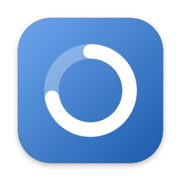
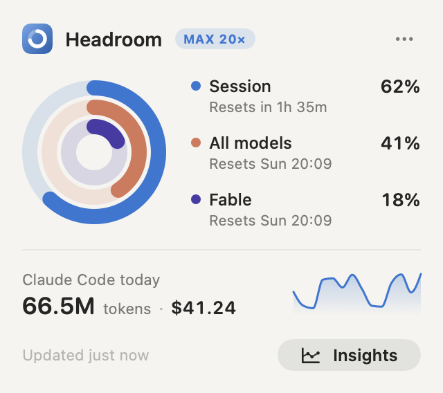
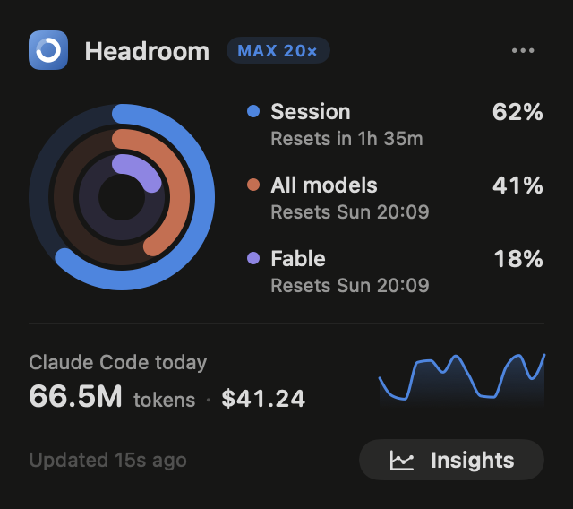
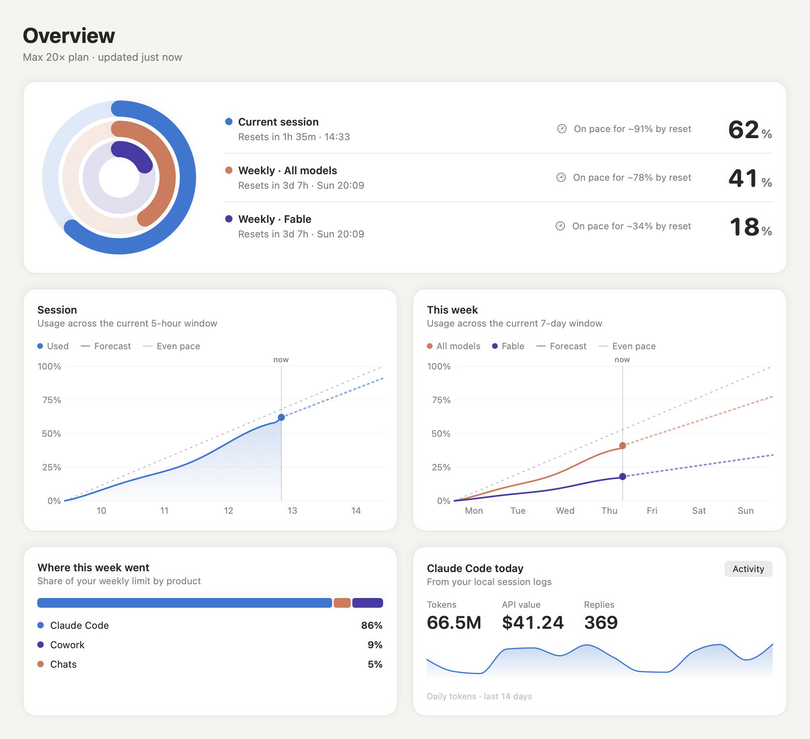
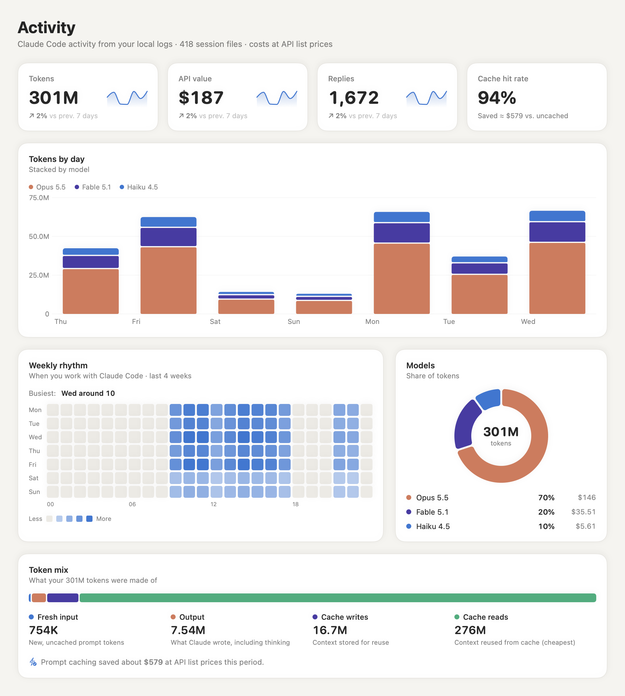
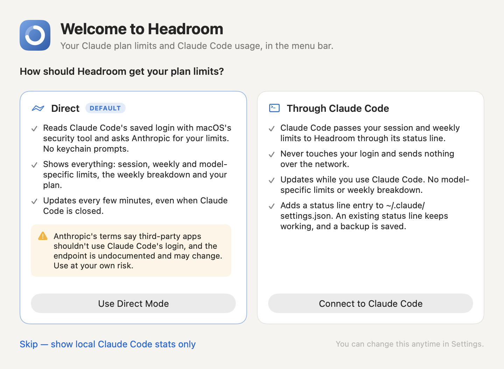

<p align="center">
  
</p>

<h1 align="center">Headroom</h1>

<p align="center">
  A native macOS menu bar app for <b>Claude Code</b> users: see how much of your Claude plan limits you have left,<br>
  and where your tokens go, with an Insights window for the details.
</p>

<p align="center">
  
  &nbsp;
  
</p>

> [!NOTE]
> Headroom is an **unofficial** community project. It is not affiliated with, endorsed by, or sponsored by Anthropic.
> Claude and Claude Code are trademarks of Anthropic, PBC.

## Features

**Menu bar**
- A ring in the menu bar shows how much of your 5-hour session you've used. It turns amber, then red, as you get close to the limit.
- The popover shows your plan limits as concentric rings with reset times. It warns you only when something needs attention, such as "limit in ~38m at this pace".
- It also shows today's Claude Code tokens and API-equivalent cost, with a 14-day trend line.

**Insights window** (⌘I from the popover)

| Overview | Activity |
|---|---|
|  |  |

- **Overview:** limit rings; burn-down charts for the session and the week showing usage, an even-pace line and a forecast to the reset; how your week split across Claude products (Direct mode only).
- **Activity** (Today / 7 days / 30 days): tokens, API-equivalent cost, replies and cache-hit rate, each with the change vs the previous period; tokens by day stacked by model; a weekday × hour heatmap; model share; token mix and what prompt caching saved.
- **Projects:** your most active projects and a sortable table.
- **Settings:** limits source, refresh interval, menu bar style, launch at login.

Works in light and dark mode. Chart colors come from a palette checked for colorblind readability, and warnings always show an icon and a label, not just a color.

## Requirements

- macOS 26 (Tahoe) or later
- Xcode 26 or later, and [XcodeGen](https://github.com/yonaskolb/XcodeGen) (`brew install xcodegen`)
- [Claude Code](https://code.claude.com). Plan limits need a Claude **Pro or Max** subscription; the activity stats work with any Claude Code setup.

## Install

**Download:** grab the latest `Headroom-x.y.z.zip` from [Releases](https://github.com/AzeemMuzammil/headroom/releases), unzip it, and move **Headroom.app** to Applications. Releases are signed and notarized by Apple, so it opens like any other app.

**Or build from source:**

```sh
git clone https://github.com/AzeemMuzammil/headroom.git
cd headroom
./scripts/build.sh --install     # builds, copies to /Applications/Headroom.app, and launches
```

On first launch Headroom asks how to get your plan limits:

<p align="center"></p>

| | **Through Claude Code** (recommended) | **Direct** |
|---|---|---|
| How | Claude Code passes your limits to Headroom's helper through its [status line](https://code.claude.com/docs/en/statusline) | Headroom reads Claude Code's saved login from your keychain and calls Anthropic's usage endpoint |
| Limits | 5-hour session and weekly | Session, weekly, model-specific (e.g. Fable) and the weekly breakdown by product |
| Updates | While you're using Claude Code | Every few minutes, even with Claude Code closed |
| Touches your login | No | Yes (read-only, kept in memory only) |
| Network | None | One request to `api.anthropic.com` per refresh |
| Setup | Adds a `statusLine` entry to `~/.claude/settings.json` (a backup is saved) | macOS asks once for keychain access; choose **Always Allow** |

> [!WARNING]
> **About Direct mode.** Anthropic's [terms for Claude Code](https://code.claude.com/docs/en/legal-and-compliance#authentication-and-credential-use) say OAuth logins are meant for Claude Code and Anthropic's own apps, and that third-party developers may not collect, store or intermediate them. Direct mode reads your own login locally and never stores or shares it, but it still uses that login outside Claude Code, and the endpoint is undocumented and may change or be restricted at any time. **Use it at your own risk.** "Through Claude Code" avoids this entirely.

You can switch modes, or turn plan limits off, at any time in **Settings**.

### Status line details

"Through Claude Code" sets Claude Code's `statusLine` to the helper bundled inside the app (`Headroom.app/Contents/MacOS/headroom-statusline`). The helper:
- saves only the `rate_limits` part of what Claude Code passes it, to `~/Library/Application Support/Headroom/rate-limits.json`;
- prints a short status line (`Opus 5.5 · session 24% · week 41%`).

If you already had a status line, the helper runs it with the same input and shows its output instead, so it keeps working. **Settings → Disconnect** puts it back.

Claude Code only includes limits in its status line data for Pro and Max subscribers, and only after the first response in a session. A project-level `statusLine` (in a project's `.claude/settings.json`) or `disableAllHooks` takes precedence, and Headroom won't receive limits in those projects.

> [!IMPORTANT]
> **Before deleting Headroom**, open Settings and click **Disconnect** next to "Claude Code status line". Otherwise Claude Code's status line keeps pointing at the deleted helper and goes blank. Disconnecting also restores your previous status line.

### Signing (optional)

By default the app is **ad-hoc signed**, so it builds with no Apple account. To sign with your own Apple Development certificate:

```sh
cp Config/Local.xcconfig.example Config/Local.xcconfig
security find-identity -v -p codesigning      # shows your certificate name and team ID
# edit Config/Local.xcconfig with your team ID, certificate name and bundle ID
```

This matters for Direct mode: with ad-hoc signing each rebuild changes the app's signature, so macOS asks for keychain access again. `Config/Local.xcconfig` is gitignored.

## Privacy

- **Nothing is collected.** There's no telemetry or analytics, and no server of our own.
- **Local stats** come from Claude Code's logs in `~/.claude/projects/**/*.jsonl` (also `~/.config/claude/projects`, and `$CLAUDE_CONFIG_DIR/projects` when Headroom is launched from a shell that has it set). They never leave your Mac.
- **Network:** "Through Claude Code" makes no network requests. Direct mode sends one request per refresh to `api.anthropic.com`, with no cache and no redirects.
- **Your login:** only Direct mode reads it. It's kept in memory only and never written to disk.
- **What's stored** in `~/Library/Application Support/Headroom/`:

  | File | Contains |
  |---|---|
  | `snapshot.json` | The last numbers shown, including project folder names |
  | `limit-history.json` | Limit percentages over the last 9 days, for the burn-down charts |
  | `scan-cache-v3.json` | A cache of per-reply token counts, keyed by log file path, so rescans are fast |
  | `rate-limits.json` | The limits Claude Code last passed to the helper |
  | `statusline-chain.json` | Your previous status line setting, so it keeps working and can be restored |
  | `last-usage-response.json` | Direct mode's last API response (usage figures, no credentials) |

- **Settings changed:** `~/.claude/settings.json`, only when you connect the status line; a backup is saved as `settings.json.headroom-backup`.

"API value" is what your tokens would cost at Anthropic's API list prices (`App/Services/Pricing.swift`). It is **not** what you pay on a subscription.

## Project layout

```
App/
  HeadroomApp.swift         App entry: menu bar extra and Insights window
  Services/
    StatusLineBridge.swift  "Through Claude Code": installs the status line helper, reads its data
    UsageAPI.swift          Direct mode: the usage endpoint (the only file to update if it changes)
    Credentials.swift       Direct mode: read-only keychain access
    LogScanner.swift        Incremental, cached parser for Claude Code logs
    Pricing.swift           API list prices for cost estimates
  Model/                    Models, AppModel (refresh loop, history), sample data
  UI/                       Menu popover, Insights pages, shared components
  PreviewRenderer.swift     Renders every screen to PNGs (used for these screenshots)
StatusLineHelper/main.swift The status line helper (Foundation only)
Config/                     Signing xcconfigs
scripts/                    build.sh; make_icon.swift renders the app icon
project.yml                 XcodeGen spec (the Xcode project is generated, not committed)
```

To work in Xcode: `xcodegen generate && open Headroom.xcodeproj`.

## Development

```sh
Headroom --dump-local                    # print local totals per range and exit
Headroom --render-preview <dir>          # render every screen (light and dark) with sample data
Headroom --demo                          # run the app on sample data (no keychain, no network)
swift scripts/make_icon.swift            # regenerate the app icon
```

`Headroom` means `/Applications/Headroom.app/Contents/MacOS/Headroom`, or the copy under `build/`.

`--render-preview <dir> --live` renders your *own* saved data. Don't use it for screenshots you share: they would include your project names.

**If Direct mode shows "The usage API changed":** Settings → **Copy Last API Response** copies the raw JSON, and [`App/Services/UsageAPI.swift`](App/Services/UsageAPI.swift) is the parser to update.

## Contributing

Issues and pull requests are welcome. See [CONTRIBUTING.md](CONTRIBUTING.md), and report security problems privately as described in [SECURITY.md](SECURITY.md).

## License

[MIT](LICENSE)
